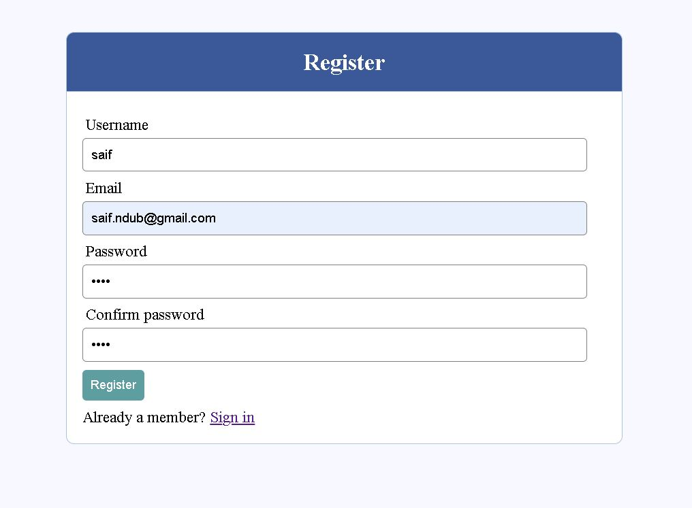

## This is a simple User Registration Form using basic HTML, PHP, CSS and DBMS.

## Run the website 
1. You have to keep the folder of the project in Xampp->htdocs
2. Open XAMPP and Start `Apache` and `MySQL` server.
2. Open your project in `localhost`
3. Go to `localhost/UserRegistrationForm` in a web browser.
4. You can view a login page in the browser.
5. You have to import `sql` command in `http://localhost/phpmyadmin/index.php`.
8. To get the access of all function of the project you have sign in to the site. Sign in as a person that you are -
    - Username `saiful` and Password `1234`
    - Username `saif` and Password `2580`

